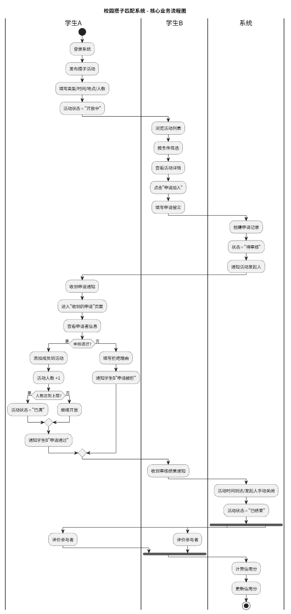
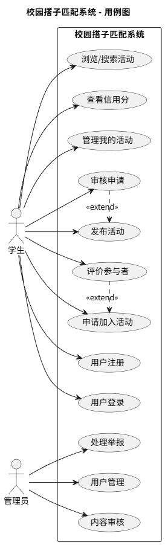

# 校园搭子匹配系统 2.0 - 需求规格说明书

| 文档版本 | 修改日期 | 修改人 | 修改说明 |
|----------|----------|--------|----------|
| v1.0 | 2026-03-23 | 黎宏 | 初稿创建 |

---

## 1. 引言

### 1.1 编写目的
本文档旨在明确校园搭子匹配系统 2.0 的功能需求、非功能需求和用户场景，为后续系统设计、编码实现和测试验收提供依据。

### 1.2 适用范围
- 系统设计人员：了解功能边界
- 开发人员：明确实现目标
- 测试人员：编写测试用例

---

## 2. 系统概述

### 2.1 项目背景
当代大学生处于从校园走向社会的过渡阶段，社交圈相对封闭，寻找志同道合的伙伴存在渠道缺失、信息过载、无法精准筛选等痛点。

### 2.2 系统目标
搭建一个安全、高效、真实的校园搭子匹配平台，让每一位大学生都能轻松找到学习、运动、吃饭等各类“搭子”。

---

## 3. 用户角色定义

| 角色 | 描述 | 核心权限 |
|------|------|----------|
| 普通学生 | 系统主要使用者 | 注册登录、发布活动、申请加入、评价 |
| 管理员 | 平台运营者 | 用户管理、举报处理、内容审核 |

---

## 4. 功能需求

### 4.1 用户模块

| 功能ID | 功能名称 | 描述 | 优先级 |
|--------|----------|------|--------|
| F-01 | 用户注册 | 学号+密码+昵称，BCrypt加密 | P0 |
| F-02 | 用户登录 | JWT认证，返回Token | P0 |
| F-03 | 查看个人信息 | 展示头像、昵称、信用分 | P0 |
| F-04 | 修改个人信息 | 修改昵称、头像 | P1 |

### 4.2 活动模块

| 功能ID | 功能名称 | 描述 | 优先级 |
|--------|----------|------|--------|
| F-05 | 发布活动 | 类型、时间、地点、人数、描述 | P0 |
| F-06 | 活动列表 | 分页展示，按时间倒序 | P0 |
| F-07 | 筛选搜索 | 按类型、时间、地点筛选 | P0 |
| F-08 | 活动详情 | 展示完整信息，含参与者列表 | P0 |
| F-09 | 编辑活动 | 发起人可修改（未有人申请时） | P1 |
| F-10 | 关闭活动 | 发起人可提前关闭 | P1 |

### 4.3 匹配模块

| 功能ID | 功能名称 | 描述 | 优先级 |
|--------|----------|------|--------|
| F-11 | 申请加入 | 填写留言，状态变为待审核 | P0 |
| F-12 | 审核申请 | 发起人通过/拒绝 | P0 |
| F-13 | 我的申请 | 查看自己申请的记录 | P0 |
| F-14 | 收到的申请 | 查看他人申请自己的活动 | P0 |
| F-15 | 智能推荐 | 基于标签、历史行为推荐活动 | P1 |

### 4.4 评价模块

| 功能ID | 功能名称 | 描述 | 优先级 |
|--------|----------|------|--------|
| F-16 | 发布评价 | 活动结束后可互评，1-5星 | P1 |
| F-17 | 查看评价 | 查看他人对自己的评价 | P1 |
| F-18 | 信用分更新 | 根据评价自动计算信用分 | P1 |

### 4.5 管理模块

| 功能ID | 功能名称 | 描述 | 优先级 |
|--------|----------|------|--------|
| F-19 | 用户管理 | 管理员查看、封禁用户 | P2 |
| F-20 | 举报处理 | 处理用户举报 | P2 |
| F-21 | 活动审核 | 审核违规活动 | P2 |

---

## 5. 非功能需求

| 类别 | 需求 | 指标 |
|------|------|------|
| 性能 | 页面加载时间 | < 3秒 |
| 性能 | 并发支持 | 1000人同时使用 |
| 安全 | 密码加密 | BCrypt |
| 安全 | SQL注入防护 | MyBatis参数绑定 |
| 可用性 | 系统可用性 | 7x24小时（除维护外） |
| 兼容性 | 浏览器支持 | Chrome、Edge最新版 |
| 可维护性 | 代码规范 | 阿里巴巴Java规范 |

---

## 6. 附录

### 6.1 用户故事
详见 [用户故事列表.md](./用户故事列表.md)

## 业务流程图

> 源文件：`diagrams/business-flow.puml`

## 用例图

> 源文件：`diagrams/use-case.puml`
