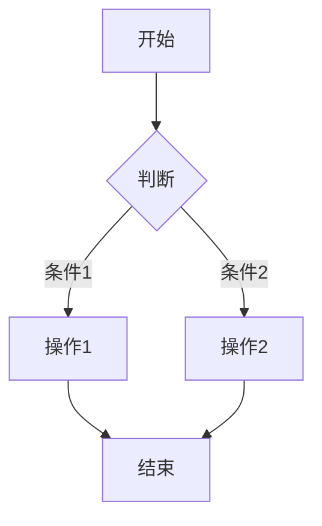
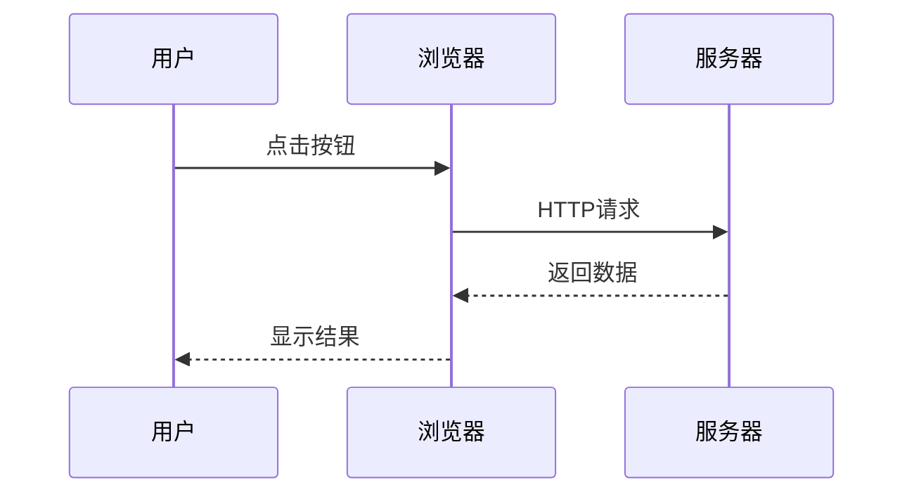
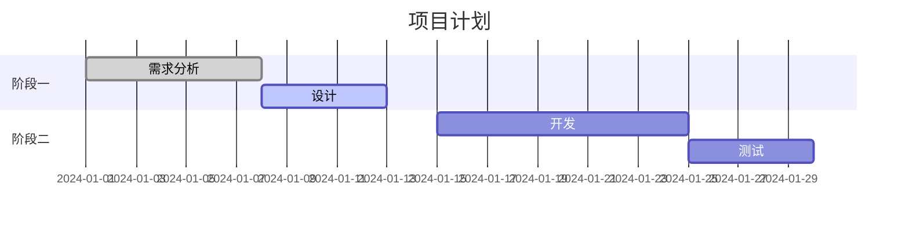
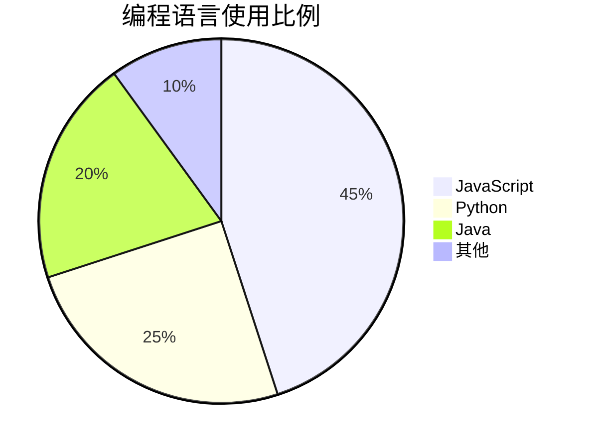

# Markdown 完全指南（从入门到精通）

> Markdown 是一种轻量级标记语言，让你用纯文本格式编写结构化文档。本文档整理了所有常用语法和进阶技巧。

## 目录
- [一、基础语法](#一基础语法)
- [二、进阶语法](#二进阶语法)
- [三、扩展语法](#三扩展语法)
- [四、实用技巧](#四实用技巧)
- [五、编辑器推荐](#五编辑器推荐)
- [六、速查卡片](#六速查卡片)

---

## 一、基础语法

### 1.1 标题
```markdown
# 一级标题
## 二级标题
### 三级标题
#### 四级标题
##### 五级标题
###### 六级标题

<!-- 另一种写法（一级和二级） -->
这是一级标题
============

这是二级标题
------------
```

**效果：**
> # 一级标题
> ## 二级标题
> ### 三级标题

### 1.2 强调与分隔

```markdown
*斜体* 或 _斜体_
**粗体** 或 __粗体__
***粗斜体*** 或 ___粗斜体___
~~删除线~~

<!-- 分隔线（三种写法） -->
---
***
___
```

**效果：**
> *斜体* 或 _斜体_
> **粗体** 或 __粗体__
> ***粗斜体*** 或 ___粗斜体___
> ~~删除线~~
> ---

### 1.3 列表

#### 无序列表
```markdown
- 项目1
- 项目2
  - 子项目2.1
  - 子项目2.2
- 项目3

<!-- 也可以用 * 或 + -->
* 苹果
* 香蕉
+ 橙子
```

#### 有序列表
```markdown
1. 第一步
2. 第二步
   1. 子步骤2.1
   2. 子步骤2.2
3. 第三步
```

#### 任务列表
```markdown
- [x] 已完成任务
- [ ] 未完成任务
- [ ] 待办事项
```

**效果：**
> - [x] 已完成任务
> - [ ] 未完成任务

### 1.4 链接和图片

```markdown
<!-- 行内链接 -->
[Google](https://www.google.com)
[带标题的链接](https://github.com "GitHub主页")

<!-- 引用链接（适合重复使用） -->
[GitHub][1]
[Markdown][2]

[1]: https://github.com
[2]: https://zh.wikipedia.org/wiki/Markdown

<!-- 自动链接 -->
<https://www.example.com>
<email@example.com>

<!-- 图片（语法和链接类似，前面加 !） -->


<!-- 带链接的图片 -->
[](链接地址)
```

### 1.5 引用
```markdown
> 这是一段引用
> 可以多行

> 嵌套引用
>> 第二层嵌套
>>> 第三层嵌套

> **注意**：引用内可以使用其他Markdown语法
> - 列表
> `代码`
```

**效果：**
> 这是一段引用
> 可以多行
>
> > 嵌套引用

### 1.6 代码

```markdown
<!-- 行内代码 -->
使用 `git status` 查看状态

<!-- 代码块（三个反引号） -->
```javascript
function hello() {
    console.log("Hello World!");
}
```

<!-- 缩进代码块（4空格或1制表符） -->
    function hello() {
        console.log("Hello World!");
    }
```

### 1.7 表格

```markdown
| 左对齐 | 居中对齐 | 右对齐 |
|:-------|:--------:|-------:|
| 单元格1 | 单元格2  | 单元格3 |
| 文本    | 居中文本 | 金额    |

<!-- 简洁写法 -->
名称 | 价格 | 数量
---|---|---
苹果 | 5.00 | 100
香蕉 | 3.50 | 200
```

**效果：**
| 左对齐 | 居中对齐 | 右对齐 |
|:-------|:--------:|-------:|
| 单元格1 | 单元格2  | 单元格3 |
| 文本    | 居中文本 | 金额    |

---

## 二、进阶语法

### 2.1 脚注
```markdown
这里需要解释一下[^1]，这里也是[^2]

[^1]: 这是脚注的解释内容
[^2]: 脚注会自动编号
```

### 2.2 定义列表
```markdown
Markdown
: 一种轻量级标记语言
: 由John Gruber发明

HTML
: 超文本标记语言
```

### 2.3 上下标（部分编辑器支持）
```markdown
H~2~O  <!-- 下标 -->
X^2^   <!-- 上标 -->
```

### 2.4 高亮（部分编辑器支持）
```markdown
==高亮文本==
```

### 2.5 锚点（页面内跳转）
```markdown
<!-- 定义锚点 -->
## 一、基础语法 {#basic}

<!-- 跳转到锚点 -->
[跳转到基础语法](#basic)
[跳转到标题](#一基础语法)
```

### 2.6 HTML混编
```markdown
<div style="color: red;">
  <p>可以直接使用HTML标签</p>
  <p style="font-size: 20px;">自定义样式</p>
</div>

<!-- 常用HTML标签 -->
<kbd>Ctrl</kbd> + <kbd>C</kbd>
<mark>标记文本</mark>
<small>小号文本</small>
<br>  <!-- 换行 -->
```

---

## 三、扩展语法

### 3.1 Mermaid流程图
````markdown

````

**渲染效果：**


### 3.2 时序图
````markdown

````

### 3.3 甘特图
````markdown

````

### 3.4 LaTeX数学公式
```markdown
<!-- 行内公式 -->
质能方程：$E = mc^2$

<!-- 独立公式（块级） -->
$$
\int_a^b f(x)\,dx = F(b) - F(a)
$$

$$
\begin{pmatrix}
a & b \\
c & d
\end{pmatrix}
$$
```

### 3.5 图表（Mermaid）
````markdown

````

---

## 四、实用技巧

### 4.1 转义字符
```markdown
\*这不是斜体\*
\# 这不是标题
\- 这不是列表
\[这不是链接\]
```

### 4.2 换行与段落
```markdown
<!-- 两个空格 + 换行 实现软换行 -->
第一行··
第二行

<!-- 空一行 实现新段落 -->
第一段

第二段
```

### 4.3 折叠内容（HTML实现）
```html
<details>
<summary>点击展开详情</summary>

这里是折叠的内容，支持 **Markdown** 语法

- 列表1
- 列表2

```python
print("Hello World")
```

</details>
```

**效果：**
<details>
<summary>点击展开详情</summary>

这里是折叠的内容，支持 **Markdown** 语法

- 列表1
- 列表2

```python
print("Hello World")
```

</details>

### 4.4 添加目录（TOC）
```markdown
<!-- 自动生成目录（部分编辑器支持） -->
[TOC]

<!-- 或手动锚点 -->
# 目录
- [标题一](#标题一)
- [标题二](#标题二)
```

### 4.5 注释
```markdown
<!-- HTML注释方式，不会显示在渲染结果中 -->
[//]: # "这也是注释（Markdown注释）"
[//]: # "适合写一些说明文字"
```

### 4.6 表情符号
```markdown
:smile: :heart: :+1: :rocket:

<!-- GitHub支持的emoji列表 -->
:octocat: :shipit: :tada:
```

**效果：** 😄 ❤️ 👍 🚀

### 4.7 高级表格技巧
```markdown
<!-- 表格内换行（使用HTML） -->
| 项目 | 说明 |
|:-----|:-----|
| 多行内容 | 第一行<br>第二行<br>第三行 |

<!-- 表格内列表 -->
| 功能 | 详情 |
|:-----|:-----|
| Git命令 | <ul><li>git add</li><li>git commit</li><li>git push</li></ul> |
```

---

## 五、编辑器推荐

### 5.1 在线编辑器
| 编辑器 | 特点 | 地址 |
|:-------|:-----|:-----|
| **StackEdit** | 功能强大，支持云同步 | https://stackedit.io |
| **马克飞象** | 专为印象笔记设计 | https://maxiang.io |
| **Cmd Markdown** | 中文友好，实时预览 | https://www.zybuluo.com/mdeditor |
| **HackMD** | 协作编辑，分享方便 | https://hackmd.io |
| **Dillinger** | 简洁易用 | https://dillinger.io |

### 5.2 桌面编辑器
| 编辑器 | 平台 | 特点 |
|:-------|:-----|:-----|
| **Typora** | Win/Mac/Linux | 极致简洁，所见即所得 |
| **VS Code** | Win/Mac/Linux | 插件丰富，免费开源 |
| **Obsidian** | Win/Mac/Linux | 双链笔记，知识库管理 |
| **Mark Text** | Win/Mac/Linux | 开源免费，类似Typora |
| **Bear** | Mac/iOS | 美观，标签系统优秀 |
| **MWeb** | Mac | 专业Markdown写作工具 |
| **Notable** | Win/Mac/Linux | 笔记管理，支持标签 |
| **Zettlr** | Win/Mac/Linux | 学术写作，引用管理 |

### 5.3 VS Code 推荐插件
```json
{
  "必备插件": [
    "Markdown All in One",
    "Markdown Preview Enhanced",
    "Markdownlint",
    "Paste Image",
    "Mermaid Preview"
  ],
  "可选插件": [
    "Markdown PDF",
    "Markdown Table",
    "Markdown Emoji",
    "GitHub Markdown Preview"
  ]
}
```

---

## 六、速查卡片

### 6.1 一分钟速查表
```markdown
# 标题
## 标题

**粗体** *斜体* ***粗斜体*** ~~删除线~~

- 无序列表
1. 有序列表
- [x] 任务列表

[链接](地址)


> 引用
`行内代码`

```语言
代码块
```

| 表格 | 表格 |
|------|------|

---
```

### 6.2 常用快捷键（Typora风格）
| 功能 | Windows/Linux | macOS |
|:-----|:--------------|:------|
| 粗体 | `Ctrl + B` | `Cmd + B` |
| 斜体 | `Ctrl + I` | `Cmd + I` |
| 下划线 | `Ctrl + U` | `Cmd + U` |
| 代码块 | `Ctrl + Shift + K` | `Cmd + Option + C` |
| 行内代码 | `Ctrl + Shift + ` | `Cmd + Shift + ` |
| 链接 | `Ctrl + K` | `Cmd + K` |
| 图片 | `Ctrl + Shift + I` | `Cmd + Option + I` |
| 有序列表 | `Ctrl + Shift + [ ` | `Cmd + Option + [` |
| 无序列表 | `Ctrl + Shift + ]` | `Cmd + Option + ]` |
| 引用 | `Ctrl + Shift + Q` | `Cmd + Option + Q` |
| 标题（1-6） | `Ctrl + 1-6` | `Cmd + 1-6` |
| 表格 | `Ctrl + T` | `Cmd + Option + T` |
| 搜索 | `Ctrl + F` | `Cmd + F` |
| 替换 | `Ctrl + H` | `Cmd + Option + F` |

### 6.3 GitHub风格提醒
```markdown
> [!NOTE]
> 这是一个普通提示

> [!TIP]
> 这是一个小技巧

> [!IMPORTANT]
> 这是重要信息

> [!WARNING]
> 这是警告信息

> [!CAUTION]
> 这是危险操作提醒
```

**效果：**
> [!NOTE]
> 这是一个普通提示

> [!TIP]
> 这是一个小技巧

> [!IMPORTANT]
> 这是重要信息

> [!WARNING]
> 这是警告信息

> [!CAUTION]
> 这是危险操作提醒

---

## 七、最佳实践

### 7.1 写作规范
```markdown
1. **中英文之间加空格**：这是一个 Git 教程
2. **标点符号统一**：使用中文标点「」
3. **列表层级清晰**：最多不要超过3层
4. **图片添加说明**：方便SEO和阅读
5. **合理使用分割线**：但不要过多
```

### 7.2 常用模板

#### 技术文档模板
```markdown
# 文档标题

## 简介
简要说明文档目的和内容

## 环境要求
- 软件版本
- 依赖环境

## 安装步骤
1. 第一步
2. 第二步

## 使用方法
### 基本用法
### 进阶用法

## 常见问题
### Q1：问题描述
A1：解决方案

## 参考资料
- [链接1]()
- [链接2]()
```

#### 笔记模板
```markdown
# 主题名称

## 核心概念
- 关键点1
- 关键点2

## 详细内容
### 小节1
内容...

### 小节2
内容...

## 总结
- 收获
- 待深入

## 参考资料
```

#### 项目README模板
```markdown
# 项目名称


[](LICENSE)

## 项目简介
一句话介绍项目

## 特性
- 特性1
- 特性2

## 快速开始
### 安装
```bash
命令
```

### 使用示例
```python
代码示例
```

## 文档
- [API文档](./docs/api.md)
- [开发指南](./docs/development.md)

## 贡献指南
[CONTRIBUTING.md](./CONTRIBUTING.md)

## 许可证
[MIT](./LICENSE)
```

---

## 八、资源推荐

### 8.1 学习资源
- [Markdown 官方文档](https://daringfireball.net/projects/markdown/)
- [GitHub Markdown 指南](https://docs.github.com/zh/get-started/writing-on-github)
- [Markdown 语法说明（中文）](https://markdown.com.cn/)
- [Mastering Markdown](https://masteringmarkdown.com/)

### 8.2 工具网站
- [Tables Generator](https://www.tablesgenerator.com/markdown_tables) - 表格生成器
- [Markdown Emoji](https://gist.github.com/rxaviers/7360908) - Emoji 列表
- [Excalidraw](https://excalidraw.com/) - 手绘风格图表
- [Carbon](https://carbon.now.sh/) - 代码图片生成
- [Shields.io](https://shields.io/) - 徽章生成

---

**最后更新**：2025年

**使用建议**：将本文档保存为 `markdown-guide.md`，作为日常参考。遇到不熟悉的语法时，直接搜索对应章节即可。
